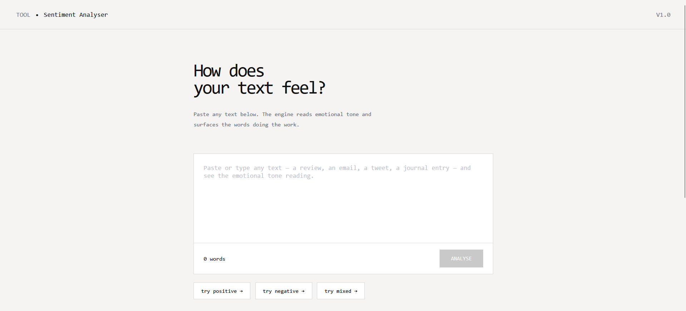
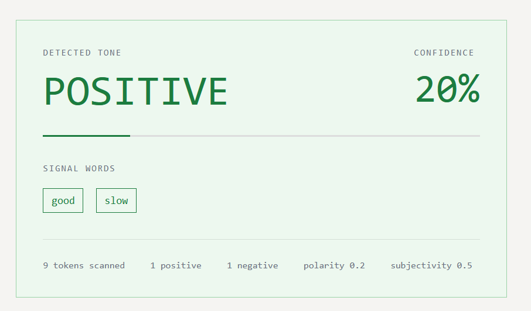

# Sentiment Analysis Web Application
A Flask-based web application that performs sentiment analysis on user-entered text using TextBlob. The application classifies text as Positive, Negative, or Neutral and displays polarity and subjectivity scores in a user-friendly interface.

## Features

- Sentiment Analysis using TextBlob
- Positive, Negative, and Neutral Classification
- Polarity Score Display
- Subjectivity Score Display
- Responsive Web Interface
- Real-Time Text Analysis
- Clean Bootstrap UI

## Tech Stack

- Python
- Flask
- TextBlob
- HTML5
- CSS3
- Bootstrap 5

## Algorithm

1. User enters text.
2. Flask receives input.
3. TextBlob processes the text.
4. Extract polarity and subjectivity.
5. Classify sentiment:
   - Polarity > 0 → Positive
   - Polarity < 0 → Negative
   - Polarity = 0 → Neutral
6. Display results.

## Screenshots

### Home Page



### Analysis Result



## Installation

### Clone Repository

```bash
git clone https://github.com/yourusername/sentiment-analysis-webapp.git
cd sentiment-analysis-webapp
```

### Create Virtual Environment

```bash
python -m venv venv
```

### Activate Environment

Windows:

```bash
venv\Scripts\activate
```

Linux/Mac:

```bash
source venv/bin/activate
```

### Install Dependencies

```bash
pip install -r requirements.txt
```

## Run Application

```bash
python app.py
```

Open:

```text
http://127.0.0.1:5000
```

## Author

### Abu Huraira

Aspiring Machine Learning Engineer and Python Developer with experience in building web applications, automation tools, and AI-powered solutions.

This project was developed as part of an internship assignment to demonstrate practical implementation of Natural Language Processing (NLP) concepts using Flask and TextBlob.

GitHub: https://github.com/abuhamjad

## License

This project is licensed under the MIT License.
